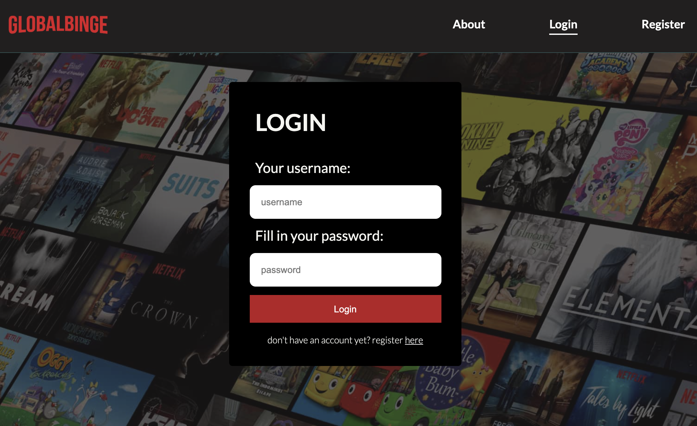
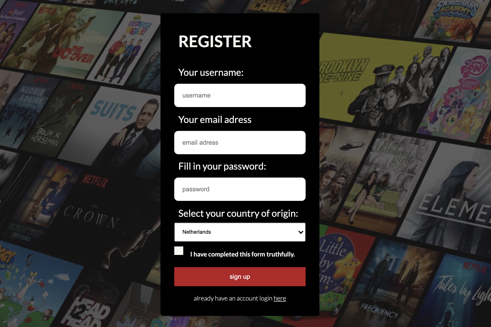
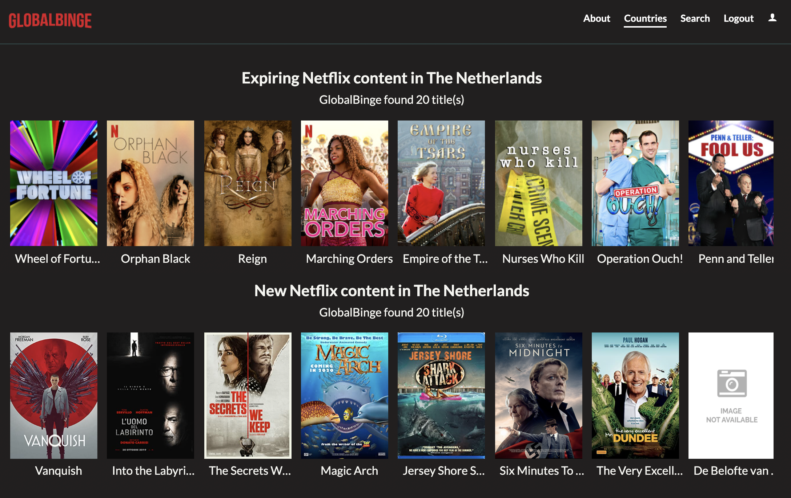
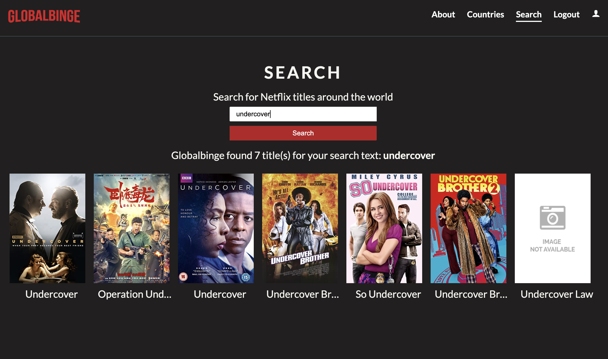

<br />
<p align="center">
  <a href="https://github.com/nteulings/frontend-eindopdracht-globalbinge">
    
  </a>

<h3 align="center">GlobalBinge</h3>

  <p align="center">
    This application lets you search for Netflix content around the world
    <br />
    <a href="https://github.com/nteulings/frontend-eindopdracht-globalbinge"><strong>Explore the docs »</strong></a>
 </p>

<!-- TABLE OF CONTENTS -->
<details open="open">
  <summary><h2 style="display: inline-block">Table of Contents</h2></summary>
  <ol>
    <li>
      <a href="#about-the-project">About The Project</a>
      <ul>
        <li><a href="#built-with">Built With</a></li>
      </ul>
    </li>
    <li>
      <a href="#getting-started">Getting Started</a>
      <ul>
        <li><a href="#prerequisites">Prerequisites</a></li>
        <li><a href="#installation">Installation</a></li>
      </ul>
    </li>
    <li><a href="#usage">Usage</a></li>
    <li><a href="#license">License</a></li>
    <li><a href="#contact">Contact</a></li>
  </ol>
</details>

## About The Project


This react web application was built for a school assignment.
It allows the user to search for Netflix titles all over the world
and also lists the new and almost expired content per country.
This application uses an the [UnogsNG](https://rapidapi.com/unogs/api/unogsng/) API-key from [RapidApi](https://rapidapi.com)


### Built With

This project was bootstrapped with [Create React App](https://github.com/facebook/create-react-app).

## Getting Started

To get a local copy up and running follow these simple steps.

### Prerequisites
* Nodejs is required. Before installing check if Nodejs is installed
  open your terminal an run:

    ```sh
    node -v
    ```
  find more informationn about Nodejs [here]( https://nodejs.org/en/ )


* For running the applicatie you need an API-key from [UnogsNG](https://rapidapi.com/unogs/api/unogsng/)

### Installation

1. Clone the repo
   ```sh
   git clone https://github.com/nteulings/frontend-eindopdracht-globalbinge.git
   ```
2. Install NPM packages
   ```sh
   npm install
   ```
   a `node_modules` directory is created and all used dependencies will be installed.


3. Place your API-key in the Environment variables

* Copy the `.env.dist` file and rename to `.env` file
  Place your API-key in place of `YOUR_API_KEY`
   ```sh
   REACT_APP_API_KEY=YOUR_API_KEY
   ```

## Usage
* LOGIN  
  Login is required to use the application  
  &nbsp;

  &nbsp;
* REGISTER  
  After signing up you will be redirected to the login page.  
  &nbsp;
  
  &nbsp;
* COUNTRIEs
  After selecting a country New and expiring content will be displayed.  
  &nbsp;
  
  &nbsp;
* SEARCH
  The search page let you search for Netflix titles around the world  
  &nbsp;  
  
  &nbsp;
* DETAILINFO  
  All titles (poster images) are clickable and detail information will be displayed.  
  &nbsp;
  
  &nbsp;
## Available scripts

In the project directory, you can run:

   ```sh
   npm start
   ```

Runs the app in the development mode.\
Open [http://localhost:3000](http://localhost:3000) to view it in the browser.

The page will reload if you make edits.\
You will also see any lint errors in the console.

   ```sh
   npm test
   ```

Launches the test runner in the interactive watch mode.\
See the section about [running tests](https://facebook.github.io/create-react-app/docs/running-tests) for more information.

   ```sh
   npm run build
   ```

Builds the app for production to the `build` folder.\
It correctly bundles React in production mode and optimizes the build for the best performance.

The build is minified and the filenames include the hashes.\
Your app is ready to be deployed!

See the section about [deployment](https://facebook.github.io/create-react-app/docs/deployment) for more information.

   ```sh
   npm run eject
   ```

**Note: this is a one-way operation. Once you `eject`, you can’t go back!**

If you aren’t satisfied with the build tool and configuration choices, you can `eject` at any time. This command will remove the single build dependency from your project.

Instead, it will copy all the configuration files and the transitive dependencies (webpack, Babel, ESLint, etc) right into your project so you have full control over them. All of the commands except `eject` will still work, but they will point to the copied scripts so you can tweak them. At this point you’re on your own.

You don’t have to ever use `eject`. The curated feature set is suitable for small and middle deployments, and you shouldn’t feel obligated to use this feature. However we understand that this tool wouldn’t be useful if you couldn’t customize it when you are ready for it.

## License
No license

## Contact
My email address: nteulings@yahoo.com  
Project Link: [https://github.com/nteulings/frontend-eindopdracht-globalbinge](https://github.com/nteulings/frontend-eindopdracht-globalbinge)
